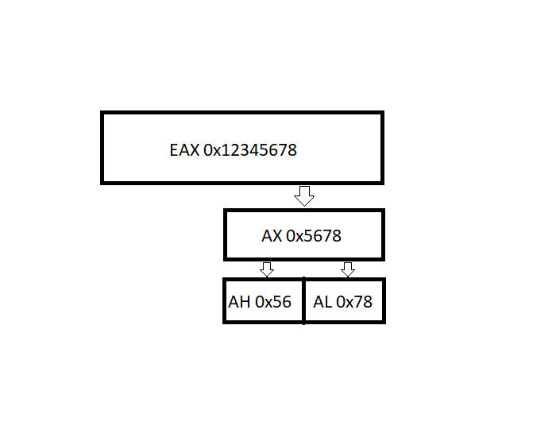

# Reverse Engineering Basics

## Assembly Language

### Stack
The stack is LIFO (Last In First Out) data structure. This is a very intuitive data structure as it functions just like a real world stack of items.

Just as with this stack of plates, the only ways you can manipulate the structure are by adding a plate to the top or removing one from the top. This is exactly how the stack data structure works:
* Push - add an element to the collection
* Pop - remove the **most recently** added element

The RAM memory layout starts at higher addresses and as more values are pushed, smaller addresses are used

### Heap
 The heap is essentially just globally stored memory. Since it's global, all functions can acess it. The heap is usually stored in the data section of a program, and the RtlAllocateHeap WinAPI function can be used to create a heap. If you read my other blog post on malware development, we use the heap as storage to plant our payload in the data section of the PE.

 ### CPU Registers
 CPU registers are small, very fast computer memory that are quickly accessible to the processor. These are necessary for the CPU to execute programs and operate efficiently. The 32-bit registers are as follows:

 |Registers | Purpose |
 | -------- | ------- |
 | EAX      | Accummulator (Arithmetic)|
 | EBX      | Base (Pointer to Data)|
 | ECX      | Counter (Shift/Rotate instructions + loops)|
 | EDX      | Data (Arithmetic and I/O)|
 | ESI      | Source Index (Pointer to Destination in string operations)|
 | EDI      | Destination Index (Pointer to Destination in string operations)|
 | EBP      | Base Pointer (Pointer)|
 | ESP      | Stack Pointer (Pointer to top of Stack)|
 | EIP      | Instruction Pointer (Address of next instruction to execute)|

There are also Segment Registers. These are essentially memory pointers inside the CPU that point to a place in memory where either data storage, or code execution begin.

You can also access parts of a register:

Flag registers are registers where each bit acts as a flag (0 or 1):

|Flag | Purpose |
| --- | ------- |
| CF | Carry Flag - is set when the result of an operation requires an arithmetic carry or borrow|
| ZF | Zero Flag - set when the result of an operation is equal to zero|
| SF | Sign Flag - set if the result of an operation is negative|
| TF | Trap Flag - set if step-by-step debugging|

### Instructions
There are three main instruction categories in Assembly Language:
1. Data Transfer (Ex: mov)
2. Flow Control (Ex: push, call, jmp, etc.)
3. Arithmetic/Logic (Ex: xor, or, and, mul, add, etc.)

Example of a data transfer operation, mov:

|Instruction | Purpose | Format | Example |
|------------|---------|--------|---------|
|mov| Move something| mov dest, src| mov eax, [edx]|

What is happening here is that the operation is moving the value stored in edx to the eax register.

Example of a flow control operation, jmp:

|Instruction | Purpose | Format | Example |
|------------|---------|--------|---------|
|jmp| Unconditional jump| *jmp address*| jmp [eax]|

What is happening here is that the operation is simply jumping to the address in [eax]. Each jump is usually preceded by either a test or compare instruction. Except for jmp, which is inherently an unconditional jump.

|Instruction | Purpose | Format | Example |
|------------|---------|--------|---------|
|test| Perform a bitwise AND on two operands. If 0, ZF is set| *test arg1, arg2*| test eax, edx|

|Instruction | Purpose | Format | Example |
|------------|---------|--------|---------|
|cmp| Compare the first operand with the second by subtraction| *cmp arg1, arg2*| cmp eax, 0|

Exmaple of an Arithmetic/Logic operation:

|Instruction | Purpose | Format | Example |
|------------|---------|--------|---------|
|add| Add src to dest| *add dest, src*| add eax, 0x10|

What is happening here is the add operation is simply adding the whatever is in source, add it to the destination and store the result in destination.

|Instruction | Purpose | Format | Example |
|------------|---------|--------|---------|
|xor| Bitwise XOR| *xor dest, src*| xor eax, eax (zeroes); xor eax, ebx (XORs)|

### Return Values
The EAX register is the one used to hold the return value of a function call. The return value can be various things from an integer, -1 (FFFFFFFF in hex), or an address.